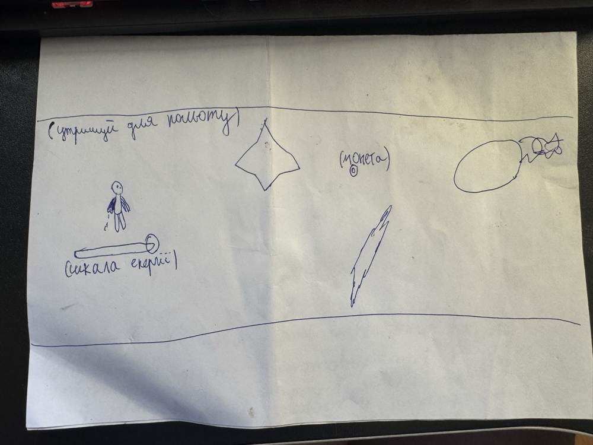

# Лабораторна робота №2 — Основи скриптування

**Студент:** Перевозник Данило Артурович  
**Група:** ІНБ-2-23  
**Спеціальність:** 122 Комп'ютерні науки  

---

## 1. Назва гри

AstroJet 1982 (копия джетпак джой)
(Аркадна космічна гра на виживання)

## 2. Основна дія (1 речення)

«Керуй космонавтом, вчасно затискай кнопку для зльоту на реактивному ранці та ухиляйся від пасток, контролюючи рівень перегріву двигуна.»

## 3. Схема керування

Пристрій: одна кнопка (Space / ЛКМ)

| Елемент | Опис |
| --- | --- |
| Space / ЛКМ | Активація реактивного ранця, рух космонавта вгору |
| Відпускання | Вимкнення двигуна, падіння вниз під дією гравітації |
| Шкала енергії | Слайдер під ногами гравця, що показує рівень нагріву ранця |

Гравець контролює вертикальний рух, обираючи момент натискання.

### Графічна схема рівня:

**Опис схеми:**
Рівень обмежений двома горизонтальними лініями — стелею та підлогою, які задають жорсткі рамки для маневрів. Персонаж знаходиться в лівій частині екрана. Безпосередньо під гравцем закріплена динамічна шкала енергії ранця. Перешкоди (пастка-ромб Zapper, діагональний лазер, великий вогняний пропелер Spinner та широка стіна) разом із золотими монетами генеруються праворуч і рухаються на гравця, формуючи ритм і змушуючи постійно змінювати висоту польоту.

## 4. Мета гри

Пролітати між пастками та стінами, не врізаючись у них, та виживати якомога довше.
Набирати очки за:
* час виживання (пройдені перешкоди)
* кількість зібраних монет
Побити власний рекорд.

## 5. Правила

* **Рух:** космонавт постійно падає вниз під дією гравітації, якщо ранець не активний.
* **Політ:** затискання кнопки вмикає ранець, який тягне гравця вгору і витрачає енергію (йде нагрів).
* **Перегрів:** якщо шкала доходить до нуля, ранець блокується і вимикається, поки повністю не охолоне.
* **Перешкоди:** пастки з’являються справа і рухаються вліво. З часом швидкість їх руху та частота появи автоматично збільшуються.
* **Зіткнення:** дотик до будь-якої пастки або межі екрана — програш.
* **Очки та монети:** очки нараховуються за пройдені перешкоди, монети збираються на карті.
* **Game Over:** після зіткнення гра повністю зупиняється, фонова музика та звуки ранця вимикаються.
* **Рестарт:** перезапуск сцени запускає нову спробу з нуля.

## 6. Тиск — Обмеження — Наслідок

| Питання | Відповідь |
| --- | --- |
| Що створює напругу? | Постійна гравітація, динамічне прискорення темпу гри з часом, рухомі пастки та ризик перегріву ранця. |
| Що обмежується? | Контроль — лише одна кнопка; простір — рамки стелі/підлоги; час на маневр через високу швидкість об'єктів. |
| Наслідок помилки | Миттєвий програш (Game Over) і необхідність почати сесію заново. |

## 7. Core Loop (короткий опис)

* **Старт сесії** — космонавт з’являється на екрані, поточний рахунок і монети = 0.
* **Геймплей** — гравець затискає кнопку для зльоту, контролюючи висоту та шкалу нагріву під ногами.
* **Перешкоди** — пастки рухаються назустріч із поступовим прискоренням швидкості.
* **Виживання** — гравець маневрує у вузьких проходах, ухиляється від лазерів та збирає монети.
* **Помилка** — зіткнення або перегрів у невідповідний момент → Game Over.
* **Рестарт** — нова спроба з метою побити кращий результат.

Цей цикл формує “one more try” loop — бажання зіграти ще раз через очікуваність помилки.

## 8. Стиль і атмосфера

* **Жанр:** аркадна endless-гра на виживання.
* **Візуальний стиль:** 2D піксель-арт у стилі ретро-футуризму 80-х років.
* **Гравець:** космонавт із реактивним ранцем та анімацією полум'я.
* **Перешкоди:** неонові електричні пастки (Zapper), вогняні пропелери (Spinner) та металеві стіни.
* **Фон:** космічний нескінченний scrolling background із планетою та зірками.
* **Звуковий супровід:** безперервний гул двигуна при зльоті, сирена при перегріві, унікальні звуки вибуху для кожного типу пастки та фоновий чіптюн-трек.
* **Інтерфейс:** поточний рахунок (Score), кількість монет (Coins), найкращий рекорд (Best Score) та слайдер енергії.

## 9. Монетизаційна модель (ранні аркади: 25¢ за одну сесію)

* **Вартість гри:** 25 центів (один жетон) за одну спробу.
* **Сесія:** триває до першої помилки або зіткнення з об'єктом.
* **Мотивація гравця:**
    * побити власний або чужий рекорд (Best Score), який великими літерами світиться на екрані
    * зібрати більше монет за одну сесію
    * пролетіти далі крізь складніші комбінації пасток